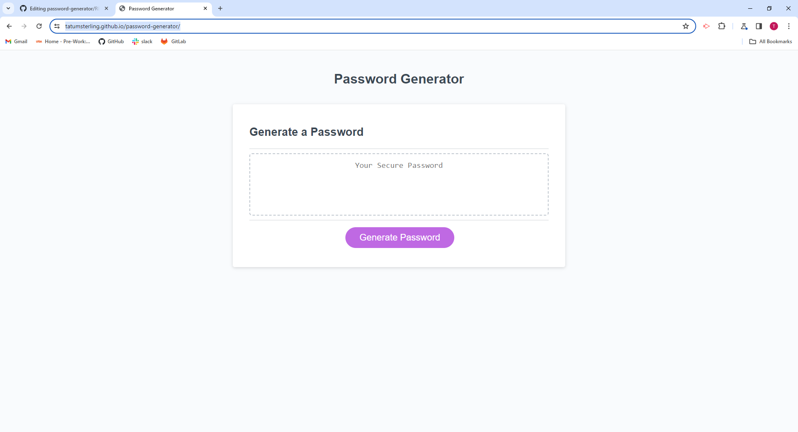

# password-generator

https://tatumsterling.github.io/password-generator/

## Description

This is my password generator.  To build this application I used simple javascript to ask the user for their input, and based on their answers produce a password that meets their requirements. If you require a strong password, my generator can provide what you need!

## Installation 

N/A

## Usage

To deploy this webpage, click on the link at the top of the README file and it will take you to my password generator. From there you can click the generate password button and you will be asked a series of questions about the contents of your password. After the prompts, your password will generate into the text area where you can highlight and copy!

below are images of my application

## Credits

N/A

## License

Please refer to the LICENSE in the repo. 
